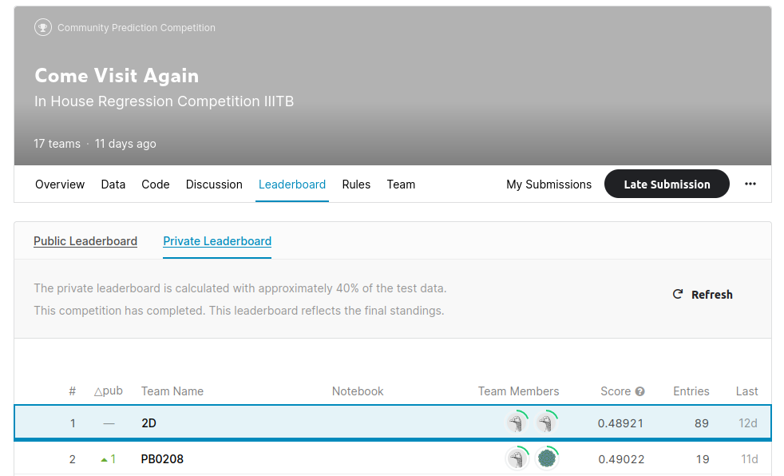

# come_visit_again_ML_Project
come visit again was the kaggle competition that was hosted by IIIT Bangalore and was a in house Data Science Competition and out task was to predict the number of visitors on particular date for a particular resturent. We have been provided with thousands of of resturents over the world as our dataset. We ended up with Rank1 in private Leaderboard and here's the solution for it :)

# Code Information

I have provided these python notebooks.

1) FeatureGen.ipynb - This Python file generates features and outputs train_data.csv that will be used by models.

2) Model Xgb - Contains xgboost model training and testing code, also generates the submission file at the end.

3) Model LightGbm - Contains LightGBM model training and testing code, also generates subsmission file at the end.

# Thank You for viewing 
